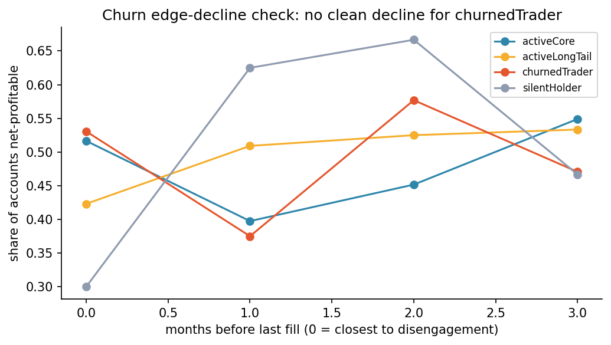
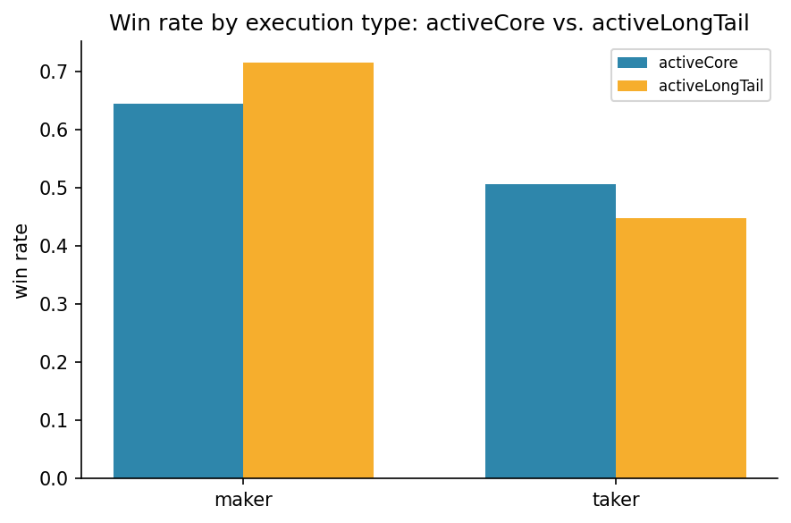
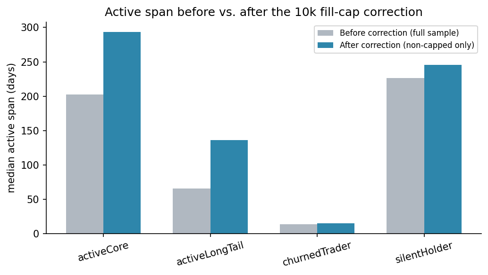
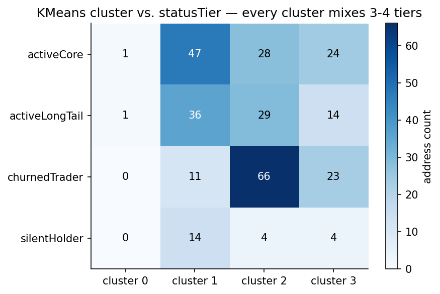

# Hyperliquid Trader Behavior

A quantitative analysis of trader behavior on Hyperliquid: 40,471 leaderboard addresses,
a stratified sample of 302 with fills history (2.08M fills), analyzed in ClickHouse and
Parquet through four `statusTier` segments (`activeCore`, `activeLongTail`,
`churnedTrader`, `silentHolder`).

**This README is the short version. Every number below is backed by a raw output table
and an explanation in [docs/findings.md](docs/findings.md) — that's the doc to read for
the actual evidence.**

## Core findings

- **Churn is disengagement-driven, not performance-driven.** Liquidation, single
  catastrophic trades, and position-escalation-into-blowup are all ruled out.
  `churnedTrader`'s share of net-profitable accounts is flat (slope 0.0022) across the
  four months leading up to each account's last fill — edge doesn't decline, activity
  does. ([details](docs/findings.md#churned-trader-edge-decline-by-month-bucket))

  
- **`activeLongTail` underperforms `activeCore` through sizing and execution, not fees.**
  Fee burden is flat at ~0.03% of notional for every tier. `activeLongTail` sizes
  positions ~24-90x more aggressively relative to account equity and relies on taker
  (aggressive) execution more (92.2% vs. 81.7% of fills) — and that taker execution
  performs worse for them specifically (44.7% win rate vs. `activeCore`'s 50.6%).
  ([details](docs/findings.md#why-active-long-tail-underperformance))

  
- **A real data-quality issue was caught and corrected before trusting the numbers.**
  Hyperliquid's `userFillsByTime` endpoint hard-caps at 10,000 fills/address; 67/302
  sampled addresses (22.2%) hit it. `activeCore`'s true median active span is 293.5 days,
  not the 202.5 days the raw data showed. ([details](docs/findings.md#capped-address-correction))

  
- **Trading style and account status are close to orthogonal.** Clustering on 12
  behavior features (intensity, sizing, execution style) against the four `statusTier`
  labels gives an adjusted Rand index of 0.079 (KMeans) / 0.010 (HDBSCAN) — both near the
  0 expected under random labeling. Every cluster mixes 3-4 status tiers.
  ([details](docs/findings.md#layer-2))

  
- Re-clustering `churnedTrader` alone (no tier labels) independently rediscovers the
  `activeLongTail` mechanism in ~45% of the tier: a sub-group with a 100% taker share and
  a 41.2% taker win rate, the worst of any group in the project.
  ([details](docs/findings.md#churned-subcluster-mechanism))

## Repository layout

```
python/            analysis scripts, run in the order in docs/analysis-workflow.md
dashboard/app.py   Streamlit dashboard — interview-narrative walkthrough of the findings
output/reports/    self-contained interactive HTML report (no server needed to view)
docs/images/       static chart exports embedded in this README
output/            generated parquet artifacts
docs/findings.md          full raw-output tables, explanations, and caveats
docs/analysis-workflow.md execution order and script -> output file mapping
operationLog.md           ClickHouse schema and query notes
```

## Run locally

```bash
uv sync
uv run streamlit run dashboard/app.py
```

The dashboard reads live from `output/*.parquet`. To regenerate those from scratch,
follow [docs/analysis-workflow.md](docs/analysis-workflow.md).

**Don't want to run a server?** `output/reports/traderBehaviorReport.html` is a
self-contained interactive report (charts keep hover/zoom via embedded Plotly JS)
generated from the same data — just open it in a browser. Regenerate both that file and
the README chart images above with:

```bash
uv run python python/generateStaticReport.py
```

## Known limitations

- Sample sizes shrink fast in some cuts (`silentHolder` is 22 addresses; some cohort/
  month-bucket cells drop below n=10) — flagged inline wherever it affects a conclusion.
- The `notional / accountValue` "leverage" proxy uses a single leaderboard snapshot per
  address, not point-in-time equity, and `churnedTrader`'s current `accountValue` is
  often a near-zero post-churn snapshot — excluded from sizing conclusions for that tier.
- Layer 3 (funding-rate microstructure) was scoped but not executed — see
  [docs/findings.md](docs/findings.md#future-work-not-executed).